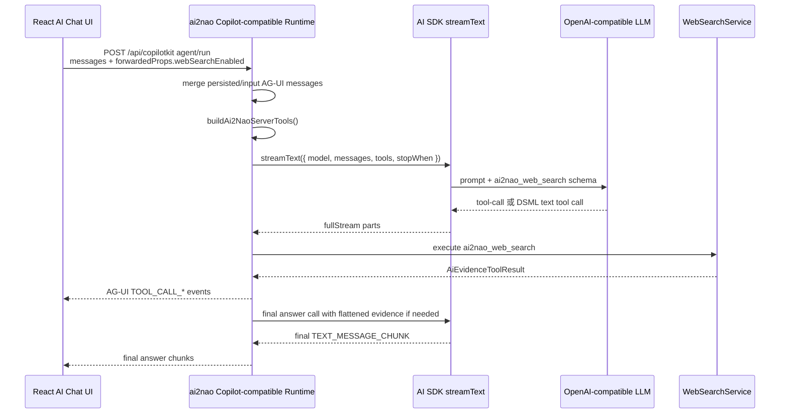

# LLM Web Search Tool 技术说明

本文说明 ai2nao 的 Web Search tool 如何接入 LLM 对话链路。核心原则是：CopilotKit 只负责前端 UI 和 AG-UI 事件展示，不参与后端 tool 选择、执行、消息修复或最终回答生成；这些逻辑全部由 ai2nao 后端 runtime 控制。

## 目标

Web Search tool 用来让 LLM 在需要当前互联网信息时调用服务端搜索能力，并把结构化搜索证据带回模型，最后生成面向用户的中文回答。它解决的是“模型知道需要查，但不能直接访问外部网页”的问题。

这条链路必须满足几个约束：

- 前端不能提供或执行 CopilotKit client tools。
- 搜索 query 只能是公开安全信息，不能包含本地路径、邮箱、token、API key。
- tool result 不能直接当最终回答展示；LLM 需要基于证据综合回答。
- 即使模型只返回 tool result 后停止，或继续吐内部工具协议文本，页面也必须拿到可读回答。

## 总体流程



## 前端只传能力开关

前端页面只通过 `forwardedProps` 告诉后端本轮是否启用 Web Search，例如：

```json
{
  "webSearchEnabled": true
}
```

前端不会注册 `ai2nao_web_search` 这个 tool，也不会执行搜索。后端在 `validateAi2NaoCopilotInput()` 中拒绝 client-provided tools：如果请求里带了 `tools`，会直接报错。这样可以保证 CopilotKit 不影响后端 tool 行为。

## Tool 注册

后端在 `src/llmChat/copilotRuntime.ts` 的 `runThread()` 中调用：

```ts
const serverTools = buildAi2NaoServerTools(deps, input.forwardedProps);
```

`buildAi2NaoServerTools()` 位于 `src/llmChat/tools.ts`。当 `forwardedProps.webSearchEnabled === true` 时，它注册 `ai2nao_web_search`：

```ts
tools.ai2nao_web_search = tool<WebSearchInput, AiEvidenceToolResult>({
  description: "Search the public web and return structured WEB evidence...",
  inputSchema: webSearchInput,
  execute: async ({ query, reason, count }, options) => {
    return webSearch.search(
      { query, reason, count },
      { enabled: props.webSearchEnabled, signal: options.abortSignal }
    );
  },
});
```

输入 schema：

- `query`: 短搜索词，只允许公开安全内容。
- `reason`: 可选，说明为什么需要搜索。
- `count`: 可选，结果数量。

输出类型是统一证据结构 `AiEvidenceToolResult`，定义在 `src/aiEvidence.ts`。

## Search Service

`WebSearchService` 位于 `src/webSearch/service.ts`。当前 provider 是 Brave Search。

执行流程：

1. 读取配置：`readWebSearchConfig()`。
2. 检查 `webSearchEnabled` 和 API key。
3. 清洗 query：`sanitizeWebSearchQuery()`。
4. 限制结果数量：`clampResultCount()`。
5. 查内存缓存，命中则返回 cache hit。
6. 调用 provider 搜索。
7. 转成 `AiEvidenceToolResult`。

成功结果形状：

```ts
{
  ok: true,
  kind: "evidence",
  source: "web",
  query,
  reason,
  generatedAt,
  evidence: [
    {
      id,
      source: "web",
      title,
      url,
      snippet,
      rank,
      provider,
      fetchedAt
    }
  ],
  meta: { provider, cached, diagnosticsId }
}
```

失败不会 throw 到 LLM runtime，而是返回：

```ts
{
  ok: false,
  kind: "evidence_error",
  source: "web",
  code,
  message,
  recoverable
}
```

这样 LLM 可以把“搜索不可用”作为证据状态回答用户，而不是让整轮对话崩掉。

## AI SDK Tool Calling

`streamText()` 接收 `tools: serverTools` 后，模型有两种可能输出：

1. 标准 AI SDK tool stream parts：
   - `tool-input-start`
   - `tool-input-delta`
   - `tool-call` / `tool-input-available`
   - `tool-result`

2. 某些 OpenAI-compatible 模型的文本协议工具调用，例如 DeepSeek 可能把工具调用吐成 DSML 文本：

```xml
<｜｜DSML｜｜tool_calls>
<｜｜DSML｜｜invoke name="ai2nao_web_search">
<｜｜DSML｜｜parameter name="count" string="false">5</｜｜DSML｜｜parameter>
<｜｜DSML｜｜parameter name="query" string="true">美团 3690 5月15日 2026 收盘价</｜｜DSML｜｜parameter>
</｜｜DSML｜｜invoke>
</｜｜DSML｜｜tool_calls>
```

标准 tool parts 由 AI SDK 自动执行。DSML 文本不是用户可见回答，必须由 ai2nao runtime 拦截。

## AG-UI 事件转换

`aiSdkStreamToAgUiEvents()` 负责把 AI SDK `fullStream` 转成前端可消费的 AG-UI events。

普通文本：

- AI SDK `text-delta`
- 转成 AG-UI `TEXT_MESSAGE_CHUNK`

标准 tool 调用：

- AI SDK `tool-input-start`
- 转成 `TOOL_CALL_START`
- 参数 delta 转成 `TOOL_CALL_ARGS`
- tool call 完成转成 `TOOL_CALL_END`
- tool result 转成 `TOOL_CALL_RESULT`

`GeneratedMessages` 会同时根据这些 AG-UI events 还原可持久化的消息：

- assistant 文本消息
- assistant toolCalls
- tool result 消息

这些消息最后写入 `llm_chat_messages`，用于会话恢复和后续轮次上下文。

## DeepSeek DSML 兼容层

DeepSeek 这类模型有时不会走标准 tool stream，而是把 tool call 以 DSML 文本输出。如果不处理，这段内部协议会直接显示到页面。

ai2nao 用 `DsmlToolCallBuffer` 处理这个问题：

1. 在 `text-delta` 流中检测 `<||DSML||tool_calls>`。
2. 暂存 DSML 块，不把它发给前端。
3. 解析 `<invoke name="...">` 和 `<parameter ...>`。
4. 构造 `DsmlTextToolCall`。
5. 通过 `createTextToolCallExecutor()` 调用同一份 server tool。
6. 向前端输出正常的 `TOOL_CALL_*` events。

也就是说，DSML 只是兼容入口，实际执行仍然走 ai2nao 后端的 `ai2nao_web_search`。

## 最终回答生成

理想情况下，AI SDK tool loop 在 tool result 后会继续让模型生成最终文本。但实际有两个风险：

- 模型在 tool result 后停止，没有最终回答。
- 模型在最终总结阶段继续想调用工具，又吐 DSML 或 tool-call。

ai2nao 做了两层防护。

第一层：如果当前 generated messages 中最新 `tool` 消息晚于最新 assistant 文本，`needsFinalAnswer()` 返回 true，runtime 会发起第二次 `streamText()`。这次不传 tools，只传扁平化证据：

```ts
messages: finalAnswerModelMessages(...)
```

`finalAnswerModelMessages()` 不再传结构化 `tool-call/tool-result` 历史，而是整理成普通 user 文本，包含：

- 用户问题
- 已执行工具证据
- 标题
- URL 或本地路径
- snippet

这样可以减少模型再次进入 tool-calling 状态。

第二层：如果最终总结后依然没有 assistant 文本，`deterministicEvidenceAnswer()` 会直接根据最新工具证据生成保底回答。这个回答不是为了替代 LLM 推理，而是为了保证用户不会遇到“搜索执行了但页面没回答”的空白状态。

## 为什么 tool result 不能直接给模型裸对象

AI SDK v6 的 `ModelMessage[]` schema 要求 `tool-result.output` 必须是判别联合类型：

```ts
{ type: "json", value: {...} }
```

或：

```ts
{ type: "text", value: "..." }
```

所以 `agUiMessagesToModelMessages()` 在恢复历史消息时，会把 AG-UI tool message 的 `content` 解析后包装成 `ToolResultOutputForPrompt`。如果直接传裸对象，会触发：

```txt
Invalid prompt: The messages do not match the ModelMessage[] schema.
```

## 配置

默认配置路径来自 `defaultWebSearchConfigPath()`，也可以通过环境变量覆盖：

```bash
AI2NAO_WEB_SEARCH_CONFIG=/path/to/web-search.json
```

配置文件示例：

```json
{
  "provider": "brave",
  "apiKey": "你的 Brave Search API Key",
  "timeoutMs": 8000,
  "defaultResults": 5,
  "maxResults": 8,
  "snippetMaxChars": 500,
  "cacheTtlMs": 300000
}
```

也可以直接使用环境变量：

```bash
BRAVE_SEARCH_API_KEY=...
```

## 关键不变量

- CopilotKit 只做 UI 展示，不参与后端 tool 逻辑。
- 前端只传 `webSearchEnabled`，不传 tools。
- Web Search tool 只在后端注册和执行。
- DSML 文本永远不能作为 assistant 文本显示给用户。
- tool result 必须被综合为最终回答；没有最终回答时必须触发兜底。
- 写入历史的 tool result 在恢复给 AI SDK 时必须符合 AI SDK v6 schema。

## 排障 checklist

如果页面“搜索了但没有回答”，按这个顺序查：

1. 看 `/api/web-search/status` 是否 `configured: true`。
2. 看后端日志是否有 `ai2nao streamText onFinish`。
3. 查 `llm_chat_messages`：
   - 是否有 assistant `toolCalls`
   - 是否有 role 为 `tool` 的搜索结果
   - 最新消息是否是空 assistant 或 DSML 文本
4. 如果有 tool result 但无最终回答，检查 `GeneratedMessages.needsFinalAnswer()` 是否触发。
5. 如果页面出现 `<｜｜DSML｜｜tool_calls>`，说明 DSML buffer 没拦截到该格式，需要补解析样例测试。
6. 如果报 `Invalid prompt`，检查 `tool-result.output` 是否包装为 `{ type, value }`。

## 相关测试

关键回归测试：

- `test/llmChat.copilotRuntime.test.ts`
  - AI SDK stream 到 AG-UI event 的转换。
  - DeepSeek DSML 文本工具调用不会渲染，会变成 tool events。
  - tool result 恢复为 AI SDK v6 schema。

- `test/llmChat.copilotRuntime.run.test.ts`
  - tool result 后模型不回答时，会追加最终回答。
  - DSML web-search 文本会执行服务端 search，不泄漏到 SSE。
  - 如果最终总结仍然吐 DSML，会走确定性证据兜底。

- `e2e/ai-chat-history.spec.ts`
  - 前端只传 feature flags，不传 client tools。
  - 搜索 tool result 后同一轮能显示最终回答。
