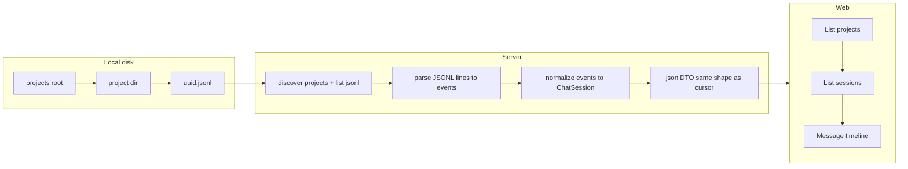

# feat: Claude Code 本地对话只读（projects + JSONL 解析 + Web）

## Overview

新增与现有 `cursorHistory` 对称的只读能力：从本机 `~/.claude/projects`（可配置）发现项目与会话文件（`*.jsonl`），对 JSONL 做健壮逐行解析与结构化归一，经 Hono API 暴露，并在 Web 端提供与 `/cursor-history` 同构的三层导航（项目 → 会话 → 消息时间线）及刷新重扫。(see origin: [docs/brainstorms/2026-04-23-claude-code-conversations-requirements.md](../brainstorms/2026-04-23-claude-code-conversations-requirements.md))

## Problem Frame

Claude Code 在本地按项目目录落盘多份会话 JSONL；用户需要在 ai2nao 内与 Cursor 历史类似的体验浏览与校验这些内容，且第一版以**解析正确性**与**可审计的未知类型处理**为核心。

## Requirements Trace

- R1–R3：默认与自定义 `projects` 根路径、仅扫描一级子目录为项目。(origin)
- R4–R8：`*.jsonl` 枚举（排除旁路文件）、逐行 UTF-8 解析、可识别类型不丢字段、损坏行可诊断、fixture 测试。(origin)
- R9–R10：只读 HTTP API、不写入 `~/.claude`。(origin)
- R11–R14：Web 刷新、解析结果可读、IA 对齐 Cursor、会话标识与摘要字段稳定。(origin)

## Scope Boundaries

- 不做跨工具合并检索、云端同步、写入、CLI 对称（除非顺带零成本）。(origin)
- 第一版不扫描 `projects` 以外的 `~/.claude` 路径。(origin)

## v1 交付切片（document-review 收束）

**v1 必须：** Unit 1–5 全交付；归一化验收为 **user/assistant 主路径 + 其余事件不丢**（附录消息 / `metadata`），不追求与 Claude Code 官方 UI 完全一致；**详情解析前 `stat`**，超限 **413/400**，禁止无界读入。

**v1 可后置（可建 issue）：** 详情 `lineOffset`/`lineLimit`、project-slug 自动解码、`?verbose=1` 调试体。

**配置：** query `projectsRoot` + 可选 env 即够；Web 高级面板为 parity 推荐项。

## Context & Research

### Relevant Code and Patterns

- 模块分层：`src/cursorHistory/`（`platform.ts` 的 `expandPath`、`index.ts` 聚合、`storage.ts` / `parser.ts`、`json.ts` DTO、`types.ts`）。(repo-research)
- HTTP：`src/serve/app.ts` 中 `/api/cursor-history/*` 的 query `dataPath` → `cursorHistoryDataPath` → `expandPath` 模式。(repo-research)
- Web：`web/src/pages/CursorHistory.tsx`、`CursorHistorySession.tsx`，`apiGet` + TanStack Query，`web/src/App.tsx` 与 `Layout.tsx` 导航。(repo-research)
- 测试：根目录 `test/<topic>.<area>.test.ts`（如 `test/cursorHistory.platform.test.ts`）。(repo-research)

### Institutional Learnings

- 仓库内无 `docs/solutions/`；无额外机构化条目。(learnings-researcher)

### External References

- 未引入外部文档；JSONL 事件形态以本机采样为准（见下「Resolved During Planning」）。

### 实机采样摘要（规划期已验证）

- 目录：`~/.claude/projects/<project-slug>/`，`project-slug` 为路径编码（如 `-Users-quincy-xunull-repository-...`）。
- 会话文件：`<uuid>.jsonl`；同目录可能存在 `<uuid>/` 子目录与 `*.jsonl.wakatime`；会话标识与文件名 stem 一致，且行内常见 `sessionId` 字段与之匹配。
- 样例行 `type` 分布示例：`assistant`、`user`、`last-prompt`、`queue-operation`、`attachment`、`file-history-snapshot`。
- `user` / `assistant` 行含 `message.content`：可为字符串或块数组（含 `text`、`thinking`、`tool_use` 等）；含 `timestamp`、`uuid`、`cwd` 等。

## Key Technical Decisions

- **模块命名**：新建 `src/claudeCodeHistory/`（与「Claude Code」产品名对齐，避免泛化 `claudeHistory`）。(see origin + repo-research)
- **HTTP 前缀**：`/api/claude-code-history/*`，与 `cursor-history` kebab 风格一致。(repo-research)
- **会话粒度**：**一个 `*.jsonl` 文件 = 一个会话**；列表与会话详情均基于文件路径；`sessionId` 采用文件名 UUID（stem）。(Resolved during planning: 实机目录结构)
- **项目展示路径**：优先使用解析得到的 `cwd`（来自事件）作为 `workspacePath`；若尚无，再回退为可读的 `project-slug` 或解码启发式（实现期可选，不阻塞）。(Resolved during planning)
- **DTO 策略**：域内保留完整 **事件联合类型**（满足 R6 不丢字段）；对外 HTTP 响应中的**会话列表与详情**使用与 `cursorHistory/json.ts` **相同 JSON 形状**（`sessionSummaryToJson` / `sessionToJson` 的字段集），通过构造 `ChatSession` / `ChatSessionSummary` 或平行函数输出同构对象，以便 Web 最大程度复用 `CursorHistory` / `CursorHistorySession` 的展示逻辑与类型。(origin Deferred + repo pattern)
- **旁路文件**：只读以 `.jsonl` 结尾且不以 `.wakatime` 结尾的文件，或显式排除 `*.jsonl.wakatime`。(Resolved during planning: 实机样本)
- **路径展开**：与 `cursorHistory` 一致使用其 `expandPath`（或在本模块内复制同等 `~/` 语义），避免与 `src/path/expandUserPath.ts` 行为漂移；可选 env：`CLAUDE_CODE_PROJECTS_ROOT` 作为未传 query 时的默认覆盖（与 `CURSOR_DATA_PATH` 模式对称，命名在实现期最终确定）。(Resolved during planning)
- **会话粒度假设（可证伪）**：在已采样版本行为下 **一个 `*.jsonl` 文件对应一个逻辑会话**，文件名 stem 与行内 `sessionId` 通常一致。若解析发现 **distinct `sessionId` 数量 > 1** 或与 stem 不一致，API 须在详情或 `warnings` 字段中返回可观测诊断（不静默吞掉）；若仅有 `<uuid>/` 目录而无 `.jsonl`，列表阶段跳过或标空（实现期择一并写测）。
- **DTO 与 `cursorHistory` 类型**：在 **不修改** `cursorHistory` 既有消费者行为的前提下，Claude 专用字段只能进入已有可选字段或 **收窄扩展**——推荐：`Message.metadata` 扩展为可承载 `claudeEventType`、`rawSnippet` 等（具体键名实现期定，需通过类型或 JSDoc 与 Cursor 解析路径区分）；非 `user`/`assistant` 事件优先合成 **附录消息**（`assistant` role + 可读 `content` 如 fenced JSON）以免污染主对话。`ChatSessionSummary` 的 **`index`**（项目内序号，从 1 递增）、**`preview`**（首条 user 可见文本截断，若无则 `(无用户消息)`）、**`workspacePath`**（优先首条可用 `cwd`，否则 `project-slug`）必须在计划中实现并与 `sessionSummaryToJson` 对齐。
- **解析完整 vs HTTP 展示**：内存/解析管线中 **保留整行 `raw` 对象** 以满足 R6；**HTTP 响应**可对过长 **展示字符串** 截断并文档化上限；**错误响应**中的 `rawSnippet` 单独设更短上限且按 UTF-8 安全截断。二者不矛盾，须在 API 文档中并列说明。
- **JSONL 行「半已知」降级**：声明 `type` 为 `user`/`assistant` 但若与预期 shape 校验不符，**整行降级为 unknown** 并保留 `raw`，避免窄化丢字段。
- **大文件底线**：任一详情解析前 **`stat`**；超过 `MAX_BYTES` 或 `MAX_LINES` 返回 **413 或 400** 及明确文案；列表接口仍可返回会话元数据（mtime/size）以便 UI 提示「过大」。
- **Web 路由（MVP 定案）**：列表 `/claude-code-history`；详情 **`/claude-code-history/s/:sessionId?projectId=<encodeURIComponent(slug)>&projectsRoot=...`**，`projectId` 为 discover 返回的目录名真源（与文件系统一致）；禁止仅依赖「sessionId 全局唯一」假设。深链打开详情时若缺 `projectId` → **404 或重定向到列表并提示**，避免静默错配项目。
- **刷新语义**：工具栏「刷新」应对 **当前视图相关** 的 query 键执行 `invalidate`：`projectsRoot` 一致时，刷新列表页 = refetch projects + sessions；在 **详情页** 时同时 refetch 当前 `session` 详情，避免列表新、详情旧。
- **威胁模型（本地只读仍可能泄露）**：默认假设 **serve 绑定 localhost**（与现有 ai2nao 约定一致处需交叉验证）；文档注明会话含敏感路径与内容、勿对不可信网络暴露；`projectsRoot` 须 **规范化为绝对路径并约束在传入根目录树内**（防 `..` 逃逸），错误语义与 Cursor `dataPath` 行为对齐。

## Open Questions

### Resolved During Planning

- **JSONL 文件集合**：每项目下枚举 `*.jsonl`，忽略 `*.jsonl.wakatime`；子目录不作为会话列表的一部分（除非实现期发现无 jsonl 仅有目录的个例，再扩展）。
- **事件类型清单（第一版须覆盖）**：至少完整保留并结构化：`user`、`assistant`；其余类型以 `type` + 全量 `payload`（或 `unknown` 分支存 `raw`）保留，并在归一化到 `Message` 时**不静默删除**（可进入 `metadata` / 附录消息）。
- **超大文件**：默认全文件解析；若单行数或字节数超过实现期设定阈值，返回明确错误或在详情 API 支持 `lineOffset`/`lineLimit` 分页（Deferred 中落地具体阈值）。

### Deferred to Implementation

- **精确阈值与分页**：在见过最大实机文件后设定 `MAX_LINES` / `MAX_BYTES` 具体数字；首版可仅硬拒绝超大详情。
- **`assistant.message.content` 全量块类型**：除已采样 `thinking` / `text` / `tool_use` 外，遇新块类型时映射为附录文本或 metadata，**保留 JSON**。
- **project-slug → 绝对路径解码**：是否做规范化反转；若不做，仅依赖 `cwd` 展示即可。
- **归一化顺序规则（须在 Unit 3 注释与测试中写死）**：默认 **文件行序** 为消息主序；`Message.timestamp` 取自事件时间戳；**不**要求「时间单调递增」除非实现选择二次按 `(timestamp, line)` 稳定排序——若采用稳定排序，测试断言改为「非递减」并注明与行序的关系；多块 `assistant` **不自动合并**，`content` 内文本块以双换行连接（或单换行，择一写入测试快照）。

## High-Level Technical Design

> *This illustrates the intended approach and is directional guidance for review, not implementation specification. The implementing agent should treat it as context, not code to reproduce.*

## Implementation Units

- [ ] **Unit 1: claudeCodeHistory 路径与发现**

**Goal:** 解析 `projectsRoot`（query 或 env 或默认 **`~/.claude/projects`**），列出项目子目录；对每个项目列出会话级 `*.jsonl`（排除 wakatime 旁路）。本单元仅 **读盘**，不对 `~/.claude` 做任何写操作（满足 R10 的 IO 侧；HTTP 只读在 Unit 4）。

**Requirements:** R1–R4（R10 在此单元仅体现为「发现层零写入」，与 R9 无关）

**Dependencies:** None

**Files:**
- Create: `src/claudeCodeHistory/paths.ts`
- Create: `src/claudeCodeHistory/discover.ts`
- Create: `src/claudeCodeHistory/index.ts`（re-export）
- Test: `test/claudeCodeHistory.discover.test.ts`

**Approach:**
- 复用 `cursorHistory/platform.ts` 的 `expandPath`（从该模块 import，避免重复实现）。
- 只读 `readdir` + `stat`；目录不可读时返回清晰错误信息（权限）。
- 会话文件过滤规则写单处常量，供 API 与测试共用。

**Patterns to follow:**
- `src/cursorHistory/platform.ts`、`getCursorDataPath` 优先级模式（自定义 → env → 默认）。

**Test scenarios:**
- Happy path：临时目录下造 `projA/uuid.jsonl`，列出 1 项目 1 会话。
- Edge case：`*.jsonl.wakatime`、无 jsonl 的空项目、混合文件。
- Error path：根路径不存在、非目录、权限拒绝（可用 chmod 测或 mock）。

**Verification:**
- 发现结果与实机 `~/.claude/projects` 抽样一致（手工或快照断言结构）。

---

- [ ] **Unit 2: JSONL 逐行解析与事件模型**

**Goal:** 将单个 `.jsonl` 文件解析为带行号的判别联合事件列表 + 每行错误列表；空行跳过；损坏行不中断整体扫描。

**Requirements:** R5–R8

**Dependencies:** Unit 1（fixture 路径可选独立）

**Files:**
- Create: `src/claudeCodeHistory/parseJsonl.ts`
- Create: `src/claudeCodeHistory/eventTypes.ts`（或内联于 parse 模块，择一）
- Create: `test/fixtures/claudeCodeHistory/sample.jsonl`（脱敏/合成，含多 type、坏行、空行）
- Test: `test/claudeCodeHistory.parseJsonl.test.ts`

**Approach:**
- 流式或整文件读入后按 `\n` 分割；每行 `JSON.parse`，失败则记录 `{ line, message, rawSnippet }`。
- 成功行映射为 `{ kind: 'known', type, ...narrow fields..., raw: object }` 与 `{ kind: 'unknown', raw }` 两级，确保 **raw 始终可还原**（满足 R6）。

**Execution note:** Test-first：先写 fixture 与失败用例，再实现解析。

**Patterns to follow:**
- 与 `src/cursorHistory/parser.ts` 类似的「多形态输入 → 统一结构」思路，但不引入 SQLite。

**Test scenarios:**
- Happy path：样例文件全部成功解析，type 计数与采样一致。
- Edge case：空行、仅空白、UTF-8 中文内容、`content` 为字符串与数组两种 `user` 行。
- Error path：半行 JSON、非对象根、混入非 JSON 行；断言后续行仍解析。
- Integration：解析结果行号与源文件人工对照（至少 1 个集成断言）。

**Verification:**
- Fixture 覆盖上述类型；`pnpm test`（或仓库等价命令）通过。

---

- [ ] **Unit 3: 事件 → ChatSession / Summary 归一化**

**Goal:** 从单文件事件序列构建 `ChatSession`（及列表用 `ChatSessionSummary`）：`id`=stem，`workspaceId`=项目目录名，`workspacePath` 优先 `cwd`，时间范围取事件时间戳 min/max，`title` 取自首条用户可见文本，`messageCount` 为归一后 `Message` 数；`user`/`assistant` 映到 `Message`（`thinking`、`toolCalls`、token usage 等从块数组抽取）；其余类型进入 `Message` 的 `metadata` 或单独「系统/附件」行（不丢）。

**Requirements:** R6, R8, R14

**Dependencies:** Unit 2

**Files:**
- Create: `src/claudeCodeHistory/normalize.ts`
- Modify: `src/claudeCodeHistory/index.ts`
- Test: `test/claudeCodeHistory.normalize.test.ts`

**Approach:**
- 排序与文本块拼接的**唯一规则**见上节 **Deferred → 归一化顺序规则**（默认文件行序；多块 assistant 不合并）。
- `assistant`：文本块按既定分隔符 join；thinking → `Message.thinking`；tool 块 → `toolCalls`（允许部分映射 + 原始 JSON 兜底）。

**Patterns to follow:**
- `src/cursorHistory/types.ts` 中 `Message`、`ChatSession` 字段语义。

**Test scenarios:**
- Happy path：含 user+assistant 的短对话，断言 role、content 摘要、**消息主序与选定排序策略一致**（默认行序；若启用 timestamp 稳定排序则断言时间非递减）。
- Edge path：仅 `queue-operation` / `attachment` 的文件仍产出会话摘要，messages 含元数据或占位，不崩溃。
- Edge case：`content` 多模态数组（thinking + text + tool_use）字段落位正确；**shape 不符的 `user` 行**降级为 unknown 后仍出现在消息或诊断列表中。

**Verification:**
- 对实机拷贝的**小段**脱敏 jsonl（可选放入 fixture）跑快照或关键字段断言。

---

- [ ] **Unit 4: HTTP API（Hono）**

**Goal:** 暴露只读端点：状态、项目列表、按项目的会话摘要列表、会话详情（完整 messages）；query：`projectsRoot`（名称与 cursor 的 `dataPath` 并列文档化）。

**Requirements:** R9–R10, R11（服务端语义）

**Dependencies:** Unit 1, Unit 3

**Files:**
- Modify: `src/serve/app.ts`（或 Create: `src/claudeCodeHistory/routes.ts` 并在 `createApp` 注册，择更清晰者）
- Test: `test/claudeCodeHistory.api.test.ts`（若已有 Hono 集成测框架；否则以纯函数测 + 轻量 `app.request`）

**Approach:**
- 路由建议：`GET /api/claude-code-history/status`、`/projects`、`/projects/:projectId/sessions`、`/projects/:projectId/sessions/:sessionId`（`projectId` URL 编码处理与 `cursorHistoryIdentifier` 类似）。
- 响应：`sessionSummaryToJson` / `sessionToJson` 同形；详情可附加 **`warnings`**（如文件 stem 与行内 `sessionId` 不一致）；错误 JSON `{ error: { message } }` 与现有 `jsonErr` 一致。

**Patterns to follow:**
- `src/serve/app.ts` 中 `cursor-history` 段落。

**Test scenarios:**
- Happy path：临时目录 fixture，GET 列表与详情 200。
- Error path：未知 `projectId` / `sessionId` → 404；根路径无效 → 400 或 500 带清晰文案。
- Integration：一次请求链：projects → sessions → session detail。

**Verification:**
- 与 Web 联调前，curl / 单测证明 JSON 形状与 Cursor 页类型兼容。

---

- [ ] **Unit 5: Web（路由 + 刷新 + 三层 IA）**

**Goal:** 新增 `/claude-code-history` 与 **`/claude-code-history/s/:sessionId?projectId=...&projectsRoot=...`**（`projectId` **必填**于详情深链），UI 结构、表格/列表与 `CursorHistory` 尽量复用样式与组件模式；**刷新**按钮按 [刷新语义](#key-technical-decisions) 失效相关 query。

**Requirements:** R11–R14

**Dependencies:** Unit 4

**Files:**
- Create: `web/src/pages/ClaudeCodeHistory.tsx`
- Create: `web/src/pages/ClaudeCodeHistorySession.tsx`
- Modify: `web/src/App.tsx`
- Modify: `web/src/components/Layout.tsx`

**Approach:**
- 列表页 `Link` 至详情时 **始终** 附带 `projectId`（discover 返回的目录名，URI 编码）。
- 高级选项：`projectsRoot` 折叠面板，与 Cursor 页 `dataPath` 交互对称。
- **Parity 清单（验收勾）**：Layout 侧栏入口并列；根路径高级区默认折叠；刷新控件可见；空态/404/权限错误有可读文案（与 Cursor 页槽位尽量一致）。
- **状态矩阵（手动）**：0 项目、0 会话、解析部分失败（API 若返回 `warnings`）、网络错误、超大文件错误提示。
- **A11y MVP**：路由切换后主区有单一 `h1`；长消息/unknown 折叠用 `button` + `aria-expanded`；表格列表有列头或 `aria-label`（若复用 Cursor 组件则注明沿用其基线）。

**Patterns to follow:**
- `web/src/pages/CursorHistory.tsx`、`CursorHistorySession.tsx`。

**Test scenarios:**
- （若项目无前端单测）手动清单：**详情页刷新**后新 JSONL 尾部可见；缺 `projectId` 打开深链有明确失败体验；未知块可折叠展开。
- Happy path（如有 RTL）：渲染会话列表非空。

**Verification:**
- 本地 `vite` + `serve` 联调通过；与实机 `~/.claude/projects` 对照可读。

---

## System-Wide Impact

- **Interaction graph：**仅新增路由与模块；不修改 `cursorHistory` 行为。
- **Error propagation：**文件 IO / JSON 错误在 API 层统一 `jsonErr`；错误体 `rawSnippet` 按 [解析完整 vs HTTP 展示](#key-technical-decisions) 截断。
- **State lifecycle risks：**无服务端缓存；刷新即重读磁盘（满足 R11）。
- **API surface parity：**与 `cursor-history` 并列；命名空间独立，避免路径冲突。
- **Integration coverage：**`discover → parse → normalize → HTTP → Web` 端到端路径至少手动跑通一次。
- **Unchanged invariants：**现有 `/api/cursor-history/*` 与 Cursor 页行为不变。

## Risks & Dependencies

| Risk | Mitigation |
|------|------------|
| JSONL schema 随 Claude Code 升级变化 | unknown 分支 + raw 保留 + fixture 在 CI 中固定已知样本；升级后补类型 |
| 单文件极大导致内存/超时 | **stat + 硬上限**；413/400；文档说明；后续分页 |
| `projectId` URL 编码（含 `-`、`%`、Unicode）与路由冲突 | `encodeURIComponent` / 单次 decode；集成测含极端 slug；非法序列 400 |
| HTTP 暴露本地会话内容 | 默认 localhost 叙事 + README 警示；`projectsRoot` 路径规范化防逃逸 |
| 「一文件一会话」假设被未来版本打破 | `sessionId` 不一致时返回 `warnings`；不静默合并 |

## Documentation / Operational Notes

- 在 `README.md` 或短 doc 中写明：**敏感数据**、默认路径、`projectsRoot` 与 env、**仅本地可信网络**。
- 无需部署变更；本地只读。

## Sources & References

- **Origin document:** [docs/brainstorms/2026-04-23-claude-code-conversations-requirements.md](../brainstorms/2026-04-23-claude-code-conversations-requirements.md)
- Related code: `src/cursorHistory/`, `src/serve/app.ts`, `web/src/pages/CursorHistory.tsx`
- 实机采样：`~/.claude/projects` 目录与 `*.jsonl` 行结构（用户本机）

## Confidence check (Phase 5.3)

**Strengthened sections（初稿）：** `Context & Research`、`Key Technical Decisions`、`Open Questions`。

**document-review 后补强：** `v1 交付切片`、`Key Technical Decisions` 增补（DTO/metadata、威胁模型、路由、刷新、raw 截断边界、可证伪假设）、Unit 1/3/5 与 Risks 表修订；并行评审：`coherence`、`feasibility`、`design-lens`、`scope-guardian`、`adversarial-document`。

**Result:** 评审结论已写入正文；可进入实现阶段（`/ce:work`）。
